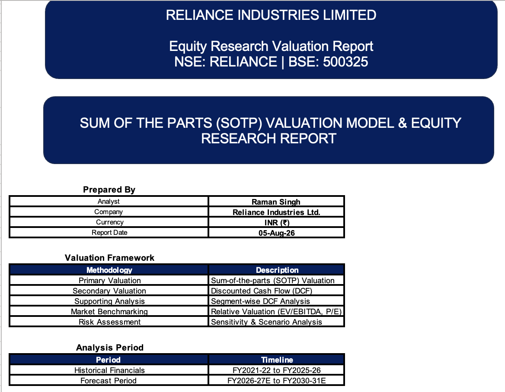
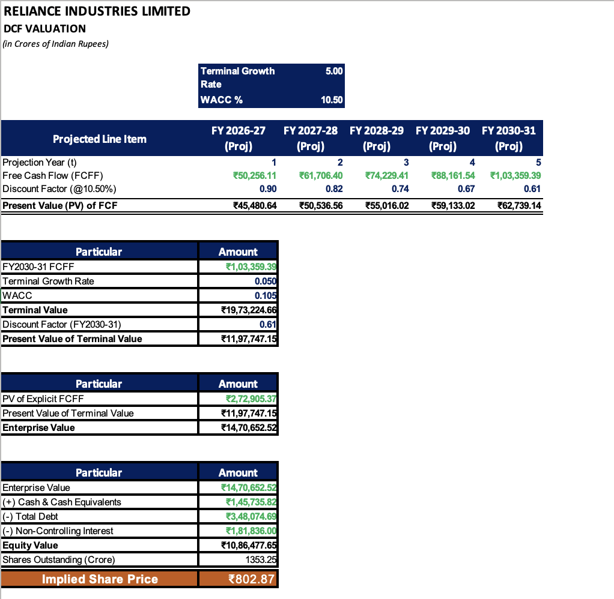
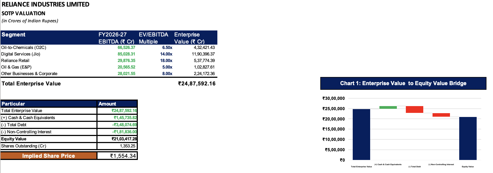
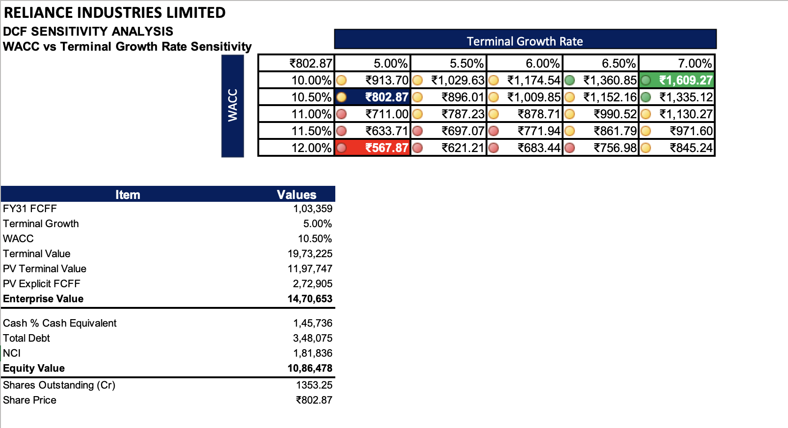
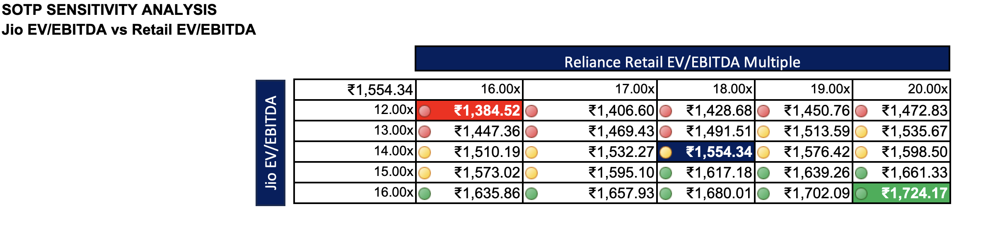

# Reliance Industries Limited (NSE: RELIANCE)
## Equity Research Valuation Model — DCF & SOTP Approach

## Project Overview

Developed a comprehensive equity valuation model for Reliance Industries Limited using Discounted Cash Flow (DCF) and Sum-of-the-Parts (SOTP) valuation methodologies.

The model forecasts FY2026-27E to FY2030-31E financial performance through segment-level operating assumptions, three-statement projections, scenario analysis, and sensitivity testing.

---

## Valuation Methodology

### Historical Financial Analysis
- Analyzed FY2021-22 to FY2025-26 historical financial performance.
- Evaluated consolidated and segment-level business trends.

### Segment Forecasting

Forecasted key business verticals:

- Digital Services (Jio)
- Reliance Retail
- Oil-to-Chemicals (O2C)
- Oil & Gas (E&P)
- Other Businesses

### Three Statement Model

Built integrated projections including:

- Income Statement
- Cash Flow Statement
- Balance Sheet

Key outputs:

- Revenue growth
- EBITDA margin progression
- PAT growth
- Free Cash Flow generation
- Balance sheet improvement

### Valuation Framework

Applied:

- FCFF Discounted Cash Flow (DCF)
- Sum-of-the-Parts (SOTP)
- EV/EBITDA-based segment valuation

### Scenario Analysis

Implemented dynamic:

- Bull Case
- Base Case
- Bear Case

using a scenario switch mechanism.

---

## Tools Used

- Microsoft Excel
- Financial Modelling
- Valuation Techniques
- Scenario Analysis
- Sensitivity Analysis

---

## Valuation Summary

| Metric | Value |
|---|---:|
| Current Market Price | ₹1,290.60 |
| DCF Target Price | ₹802.87 |
| SOTP Target Price | ₹1,554.34 |
| Weighted Target Price | ₹1,328.90 |
| Implied Upside | 2.97% |
| Recommendation | **HOLD** |

---

## Key Investment Insights

### Digital Services (Jio)
- Jio represents the largest contributor to Reliance's SOTP valuation.
- Future growth is driven by 5G monetisation, ARPU expansion, and enterprise services.

### Reliance Retail
- Retail remains a major growth engine through store expansion, productivity improvements, and operating leverage.
- EBITDA margins are expected to improve gradually as scale benefits increase.

### Oil-to-Chemicals (O2C)
- O2C continues to provide significant cash generation.
- Valuation remains sensitive to refining margins and global commodity cycles.

### Oil & Gas
- Upstream operations provide high-margin cash flows.
- KG-D6 production growth and realised gas pricing remain key drivers.

### Balance Sheet
- FCFF generation improves throughout the forecast period.
- Net debt declines gradually, strengthening financial flexibility.

---

---

## Model Screenshots

### Valuation Summary

### DCF Valuation

### SOTP Valuation

### Sensitivity Analysis

---
## Sources

- Reliance Industries Limited Annual Reports FY2021-22 to FY2025-26
- Reliance Industries Investor Presentations
- NSE market data
- Analyst assumptions and valuation framework