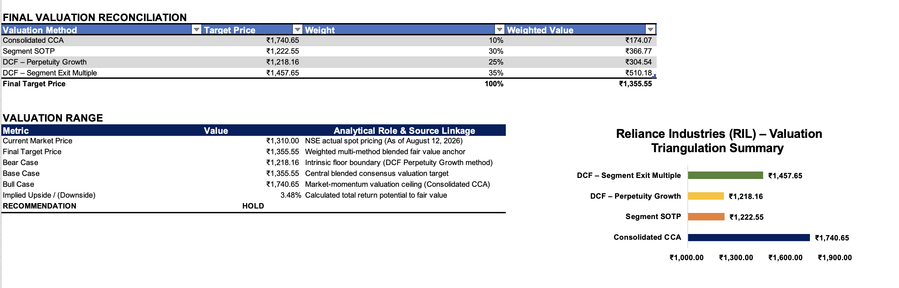
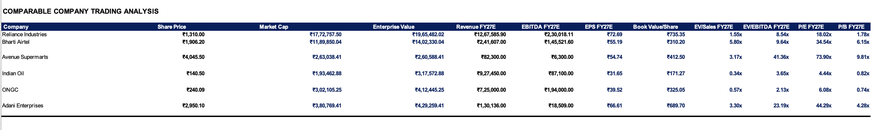
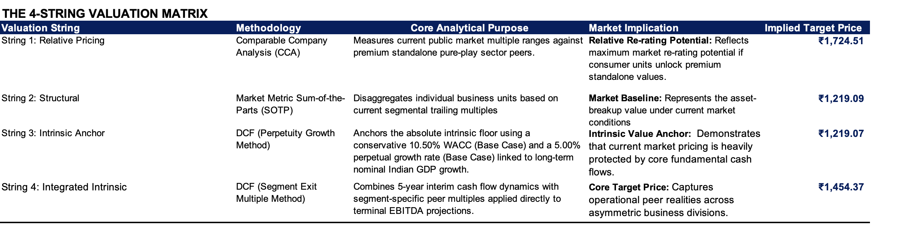
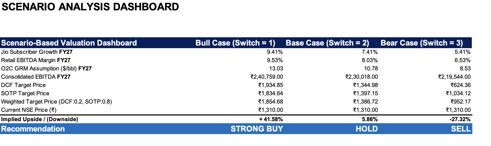

# Reliance Industries Limited (NSE: RELIANCE)

## Equity Research Valuation Model — DCF, SOTP & Relative Valuation

## Project Overview

Developed an integrated equity research valuation model for Reliance Industries Limited, combining **three-statement financial forecasting, segment-level operating analysis, FCFF-based DCF valuation, Sum-of-the-Parts (SOTP) analysis, comparable-company valuation, scenario analysis and sensitivity testing**.

The model analyzes historical performance from **FY2021-22 to FY2025-26** and forecasts **FY2026-27E to FY2030-31E** using segment-specific operating drivers, scenario assumptions and multiple valuation frameworks.

The objective is to evaluate Reliance as a diversified conglomerate rather than as a single operating business, with separate analytical treatment for:

- Digital Services (Jio)
- Reliance Retail
- Oil-to-Chemicals (O2C)
- Oil & Gas (E&P)
- Other Businesses & Corporate

The model is designed to distinguish between **fundamental intrinsic valuation**, **segment-level valuation**, and **market-relative valuation** rather than mechanically averaging methodologies with different analytical purposes.

---

# Investment Valuation Framework

The valuation architecture separates the **primary fundamental valuation** from an independent **market-relative cross-check**.

## Primary Valuation Framework

The primary valuation is derived from the integrated operating model using:

1. FCFF-based DCF valuation
2. Segment-level SOTP valuation
3. Dynamic Bull / Base / Bear scenario analysis

The primary scenario valuation combines DCF and SOTP using an **80% SOTP / 20% DCF weighting**.

This weighting reflects Reliance's diversified conglomerate structure and the greater relevance of segment-level valuation while retaining DCF as an independent intrinsic-value anchor.

## Relative Valuation Cross-Check

A separate four-string valuation framework is used to benchmark the primary valuation against observable public-market pricing.

| Valuation String | Methodology | Analytical Role |
|---|---|---|
| Relative Pricing | Consolidated Comparable Company Analysis | Market-relative valuation cross-check |
| Structural Valuation | Market-Metric SOTP | Break-up value under current market multiples |
| Intrinsic Anchor | FCFF DCF — Perpetuity Growth | Consolidated intrinsic-value anchor |
| Integrated Intrinsic | FCFF DCF — Segment Exit Multiple | Terminal valuation using segment-specific multiples |

The four-string framework is **not mechanically blended into the primary target price**. It is used as an independent cross-check to assess valuation dispersion, market re-rating potential and the sensitivity of value to alternative methodologies.

---

# Historical Financial Analysis

Analyzed FY2021-22 to FY2025-26 historical financial performance across:

- Consolidated income statement
- Balance sheet
- Cash flow statement
- Segment revenue and profitability
- Capital expenditure
- Free cash flow
- Debt and cash
- Leverage metrics
- Historical operating ratios

Historical analysis is used to establish operating trends and inform forward-looking segment assumptions.

---

# Segment Forecasting

Forecasted key Reliance business verticals using segment-specific operating drivers.

## Digital Services (Jio)

Key forecasting drivers include:

- Subscriber growth
- Subscriber monetisation
- ARPU progression
- Revenue growth
- EBITDA growth
- Margin progression
- 5G-related growth drivers
- Long-term digital ecosystem monetisation

## Reliance Retail

Key forecasting drivers include:

- Revenue growth
- Store additions
- Store productivity
- EBITDA margin
- Operating leverage
- Organized-retail penetration
- Omnichannel and format expansion

## Oil-to-Chemicals (O2C)

Key forecasting drivers include:

- Revenue growth
- EBITDA margin
- Refining margins
- GRM assumptions
- Petrochemical economics
- Commodity-cycle normalization
- Capital expenditure

## Oil & Gas (E&P)

Key forecasting drivers include:

- Production
- Realizations
- Revenue growth
- EBITDA
- EBITDA margin
- KG-D6-related operating assumptions
- Production ramp-up

## Other Businesses & Corporate

Includes:

- Other operating businesses
- Corporate-level adjustments
- Residual valuation considerations
- Corporate assets and liabilities where applicable

---

# Three-Statement Financial Model

Developed integrated projections for:

- Income Statement
- Balance Sheet
- Cash Flow Statement

Forecast period:

**FY2026-27E to FY2030-31E**

Key outputs include:

- Revenue growth
- EBITDA
- EBITDA margin
- EBIT
- PAT
- Capital expenditure
- Working capital
- FCFF
- Debt
- Cash balances
- Net debt


The statements are integrated so that changes in operating assumptions flow through the projected financial statements and ultimately into the valuation outputs.

---

# Relative Valuation

Built a comparable-company valuation framework using:

- EV/Sales
- EV/EBITDA
- P/E
- P/B

## Peer Universe

The peer universe includes segment-relevant and diversified reference companies:

- Bharti Airtel — Telecom
- Avenue Supermarts (DMart) — Retail
- Indian Oil Corporation — Refining
- ONGC — Oil & Gas
- Adani Enterprises — Diversified reference peer

Because Reliance is a diversified conglomerate, the analysis does not apply a single consolidated peer multiple mechanically across all business segments.

---

## Segment-Relevant Relative Valuation

| Reliance Segment | Primary Comparable | Relevance |
|---|---|---:|
| Digital Services (Jio) | Bharti Airtel | High |
| Reliance Retail | Avenue Supermarts (DMart) | High |
| Oil-to-Chemicals (O2C) | Indian Oil Corporation | Moderate |
| Oil & Gas (E&P) | ONGC | High |
| Diversified / Corporate | Adani Enterprises | Reference |

Comparable multiples are treated as **observable market anchors rather than mechanically transferable terminal multiples**.

For O2C and Oil & Gas in particular, Indian Oil and ONGC are reference peers rather than perfect like-for-like comparables because of differences in:

- Ownership structure
- Scale
- Business mix
- Asset characteristics
- Integration
- Capital allocation
- Private-sector versus PSU operating structures

The Main Model therefore applies segment-specific valuation multiples based on the analyst's assessment of business quality and structural characteristics.

---

## Main Model Segment Valuation Multiples

| Segment | Observable Peer Anchor | Main Model Multiple |
|---|---:|---:|
| Jio | 9.57x | **15.0x** |
| Reliance Retail | 20.07x | **22.0x** |
| O2C | 3.68x | **6.5x** |
| Oil & Gas | 2.11x | **5.5x** |

These Main Model multiples are **internal valuation assumptions**, not broker or consensus estimates.

### Jio — 15.0x EV/EBITDA

The multiple represents a premium to Bharti Airtel's observed multiple, reflecting:

- Digital ecosystem optionality
- Monetisation potential
- Scale
- Strategic positioning
- Long-term platform economics
- Potential value creation from broader digital services

The premium is based on business quality and strategic optionality rather than simply assuming higher near-term growth.

### Reliance Retail — 22.0x EV/EBITDA

The multiple represents a modest premium to the normalized peer reference multiple.

The premium reflects:

- Scale
- Diversified retail formats
- Omnichannel capabilities
- Operating margin characteristics
- Long-term organized-retail penetration
- Expansion and operating leverage potential

The selected multiple remains materially below DMart's observed trading multiple, providing valuation discipline.

### O2C — 6.5x EV/EBITDA

Indian Oil is treated as an observable market reference rather than a fully comparable private-sector benchmark.

The premium reflects differences in:

- Ownership structure
- Refining and petrochemical integration
- Asset complexity
- Scale
- Business mix
- Capital allocation framework
- Private-sector operating characteristics

### Oil & Gas — 5.5x EV/EBITDA

ONGC is used as a reference peer rather than a directly transferable valuation benchmark.

The premium reflects differences in:

- Ownership structure
- Asset portfolio
- Scale
- Operating model
- Capital allocation
- Strategic position within Reliance's broader energy platform
- Portfolio optionality

---

# DCF Valuation

The model includes two DCF approaches.

## FCFF — Perpetuity Growth

Projects consolidated FCFF over the explicit forecast period and derives terminal value using a perpetual-growth framework.

### Base DCF Assumptions

- WACC: **10.50%**
- Terminal Growth Rate: **5.00%**
- Forecast Period: **FY2026-27E to FY2030-31E**

The DCF provides an **intrinsic-value anchor**, rather than being described as a valuation floor.

The DCF bridge follows:

```text
Enterprise Value
       ↓
+ Cash & Cash Equivalents
       ↓
- Total Debt
       ↓
- Non-Controlling Interest
       ↓
Equity Value
       ↓
Diluted Shares Outstanding
       ↓
Implied Share Price
```

---
# Primary Scenario Valuation

The primary valuation framework combines the Main Model's DCF and SOTP outputs using an **80% SOTP / 20% DCF weighting**.

This blended framework is then evaluated under three operating scenarios generated by the model's dynamic scenario engine.

| Scenario | Implied Share Price | Current Price | Implied Upside / (Downside) |
| -------- | ------------------: | ------------: | --------------------------: |
| Bear     | ₹952.17             | ₹1,310.00     | **-27.3%** |
| Base     | ₹1,386.72           | ₹1,310.00     | **+5.9%** |
| Bull     | ₹1,854.68           | ₹1,310.00     | **+41.6%** |

The scenario outputs are generated directly from the integrated operating model and therefore represent the **primary valuation framework** for the investment case.

### Scenario Drivers

| Driver | Bull Case | Base Case | Bear Case |
| ------ | --------: | --------: | --------: |
| Jio Subscriber Growth FY27 | 9.41% | 7.41% | 5.41% |
| Retail EBITDA Margin FY27 | 9.53% | 8.03% | 6.53% |
| O2C GRM FY27 ($/bbl) | 13.03 | 10.78 | 8.53 |
| Consolidated EBITDA FY27 | ₹2,40,759 Cr | ₹2,30,018 Cr | ₹2,19,544 Cr |
| DCF Target Price | ₹1,934.85 | ₹1,344.98 | ₹624.36 |
| SOTP Target Price | ₹1,834.64 | ₹1,397.15 | ₹1,034.12 |
| **Weighted Target Price** | **₹1,854.68** | **₹1,386.72** | **₹952.17** |

The scenario framework demonstrates that valuation is particularly sensitive to **Jio subscriber growth, Retail margin expansion and O2C margin normalization**.

---

# Primary Valuation vs Relative Cross-Check

The Main Model and Relative Valuation serve different analytical purposes.

### Primary Valuation

The Main Model is driven by:

- Operating forecasts
- Three-statement projections
- FCFF generation
- Segment-level valuation
- Scenario analysis

The resulting scenario range is:

**₹952 – ₹1,855 per share**

with a Base Case valuation of:

**₹1,386.72 per share**

### Independent Relative Cross-Check

The four-string framework provides an independent market-based reference:

| Valuation String | Methodology | Implied Target |
| ---------------- | ----------- | -------------: |
| Relative Pricing | Consolidated Comparable Company Analysis | ₹1,724.51 |
| Structural Valuation | Relative Market-Metric SOTP | ₹1,219.09 |
| Intrinsic Anchor | DCF — Perpetuity Growth | ₹1,219.07 |
| Integrated Intrinsic | DCF — Segment Exit Multiple | ₹1,454.37 |

The relative valuation is **not mechanically blended with the Main Model**.

Instead, it is used to determine whether the primary valuation appears broadly consistent with observable market pricing and to identify potential sources of valuation dispersion.

The relative framework indicates that Reliance could command a higher valuation under stronger market recognition of its consumer and digital businesses, while the lower SOTP and DCF outputs highlight the sensitivity of valuation to terminal assumptions and segment multiples.

---

# Valuation Sensitivity Analysis

## DCF Sensitivity

The DCF sensitivity analysis evaluates the impact of changes in **WACC and terminal growth** on the implied share price.

The Base Case uses:

- WACC: **10.50%**
- Terminal Growth: **5.00%**

The sensitivity framework demonstrates significant valuation dispersion across different combinations of discount rates and terminal growth assumptions.

This reinforces the importance of treating the DCF as an **intrinsic-value anchor** rather than a standalone point estimate.

## SOTP Sensitivity

The SOTP sensitivity evaluates the interaction between:

- Jio EV/EBITDA
- Reliance Retail EV/EBITDA

The base case uses:

- Jio: **15.0x EV/EBITDA**
- Retail: **22.0x EV/EBITDA**

The sensitivity range tests:

- Jio: **13.0x–17.0x**
- Retail: **18.0x–26.0x**

This analysis highlights the extent to which Reliance's valuation depends on market recognition of the higher-growth consumer and digital businesses.

---

# Valuation Interpretation

The model produces a deliberately wide valuation range because Reliance combines businesses with materially different growth rates, margins, capital intensity and market valuation frameworks.

The analysis therefore avoids treating any single methodology as definitive.

The primary framework places greater emphasis on **SOTP and operating fundamentals**, while the independent relative valuation provides a market-based cross-check.

The resulting valuation dispersion should be interpreted as a representation of **model and market uncertainty**, rather than as a modelling inconsistency.

---
## Model Architecture
```text
               Historical Financial Analysis
                              │
                              ▼
              Segment Operating Drivers
                              │
                              ▼
             Forecast Assumptions & Scenario Engine
                              │
                              ▼
                  Three-Statement Projections
                              │
                              ▼
                       FCFF Forecast
                              │
                    ┌─────────┴─────────┐
                    ▼                   ▼
              DCF Valuation       Segment SOTP
                    │                   │
                    └─────────┬─────────┘
                              ▼
                 Primary Scenario Valuation
                       80% SOTP / 20% DCF
                              │
                 ┌────────────┼────────────┐
                 ▼            ▼            ▼
               Bear         Base         Bull
             ₹952.17      ₹1,386.72    ₹1,854.68
```
```text

              Independent Relative Valuation
                              │
                              ▼
                   Four-String Cross-Check
                              │
          ┌───────────────────┼───────────────────┐
          │                   │                   │
          ▼                   ▼                   ▼
      Relative CCA     Market-Metric SOTP    DCF Cross-Checks
      ₹1,724.51            ₹1,219.09       ┌────────┴────────┐
                                           ▼                 ▼
                                        Perpetuity      Exit Multiple
                                        ₹1,219.07      ₹1,454.37
```

## Model Workbook Structure

Assumptions Sheets:
  • 01_Overview — Model summary & current price
  • 07_Forecast_Assumptions — Revenue/margin/capex assumptions (scenario switch in D2)

Historical Analysis:
  • 02_Consolidated_Historical_Data — 5-year P&L
  • 03_Consolidated_Balance_Sheet — Historical BS  
  • 04_Consolidated_Cash_Flow — Historical CF
  • 05_Segment_Historical_Raw_Data — Segment-level metrics
  • 06_Calculated_Ratios — Historical ratio trends

Projections:
  • 08_Three_Statement_Projections — Integrated P&L/BS/CF forecast FY27-31E
  • 08A_Balance_Sheet_Support_Schedule — Fixed asset detail
  • 09_Free_Cash_Flow_Schedule — FCFF calculation

Valuation Outputs:
  • 10_DCF_Valuation — Perpetuity growth DCF (Cell F50: per share target)
  • 11_SOTP_Valuation — Segment-level DCF valuation (Cell F50: per share target)
  • 12_Scenario_Analysis_Dashboard — Bull/Base/Bear valuation outputs
  • 13_Executive_Summary — Final investment recommendation
  • 14_Key_Metrics_Dashboard — Key valuation metrics
  • 15_DCF_Sensitivity_Analysis — WACC × Terminal Growth table
  • 16_Relative_Valuation:
    - SOTP_Methodology sheet
    - DCF_vs_Comps_Reconciliation sheet
    - Bull_Base_Bear_Scenarios sheet
  • 17_Final Valuation_Dashboard


---

## Model Screenshots

### Valuation Summary


### Valuation Dashboard Reconciliation


### Market-Relative Benchmarking


### 4-String Valuation Matrix   


### DCF Valuation


### SOTP Valuation


### Sensitivity Analysis


### Dynamic Risk & Scenario Analysis


---
## Key Model Features

- [x] Integrated three-statement financial model
- [x] Segment-level forecasting for Jio, Retail, O2C and Oil & Gas
- [x] FCFF-based DCF valuation
- [x] Sum-of-the-Parts (SOTP) valuation framework
- [x] Bull/Base/Bear scenario switch
- [x] DCF and SOTP sensitivity analysis
- [x] Investor dashboard with valuation summary

---
## Key Risks

- O2C profitability remains sensitive to global refining margins and commodity cycles.
- Telecom growth assumptions depend on successful 5G monetisation and ARPU expansion.
- Retail valuation depends on sustained store productivity and margin improvement.
- Higher interest rates could impact valuation multiples and DCF assumptions.
- Regulatory changes may affect key business segments.
---

## Sources

- Reliance Industries Limited Annual Reports FY2021-22 to FY2025-26
- Reliance Industries Investor Presentations
- NSE market data
- Publicly available peer-company financial disclosures
- Publicly available market and institutional research inputs where applicable
- Author's own forecast assumptions
- Author's own scenario framework
- Author's own valuation judgments

Forward estimates, segment valuation multiples and scenario assumptions are the author's analytical assumptions unless explicitly identified as company-reported or market-observed data.

---
## Disclaimer

This project was prepared for educational and portfolio purposes only and does not constitute investment advice or a recommendation to buy or sell any security.

Historical data is based on publicly available company disclosures and market data.

Forward-looking estimates, scenario assumptions, valuation multiples, terminal assumptions and target prices represent the author's analytical judgments and may differ materially from actual results.

Comparable-company valuation is subject to differences in business mix, accounting treatment, ownership structure, scale and market conditions.

The valuation outputs should therefore be interpreted as analytical estimates rather than precise estimates of intrinsic value.

